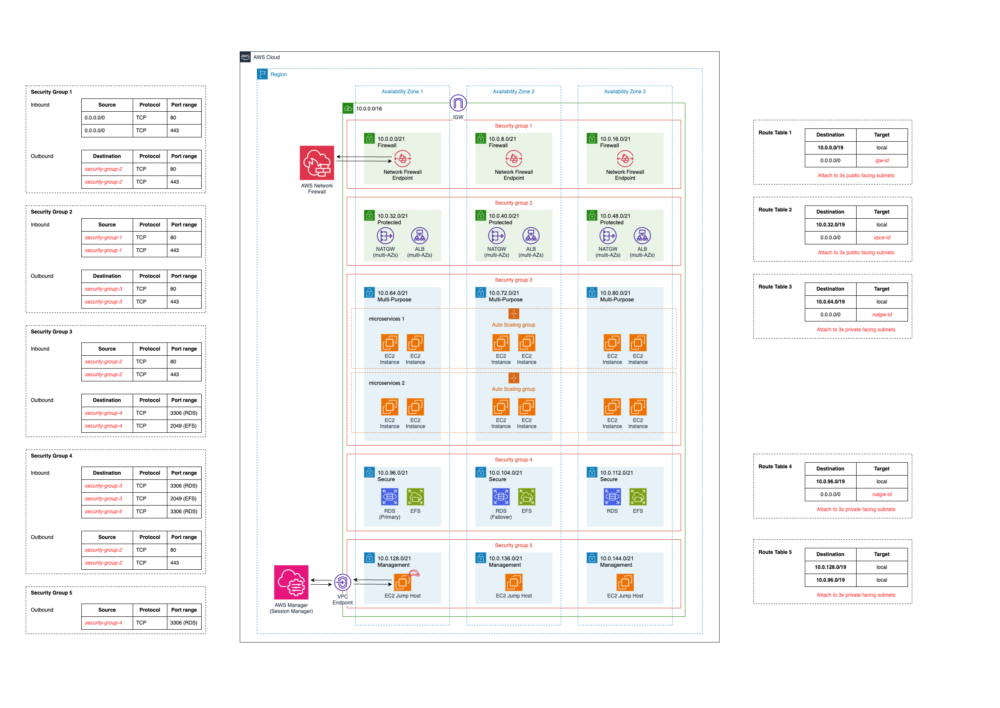
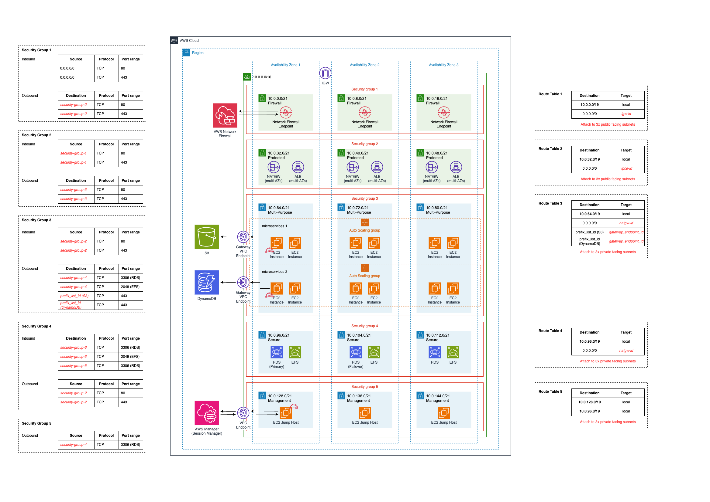
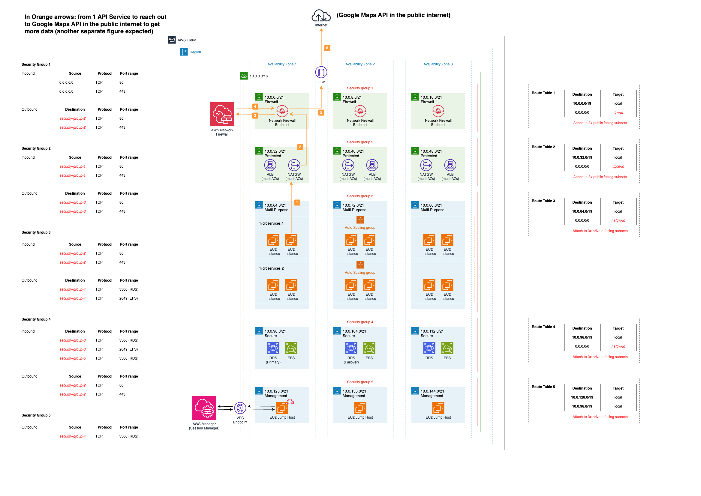
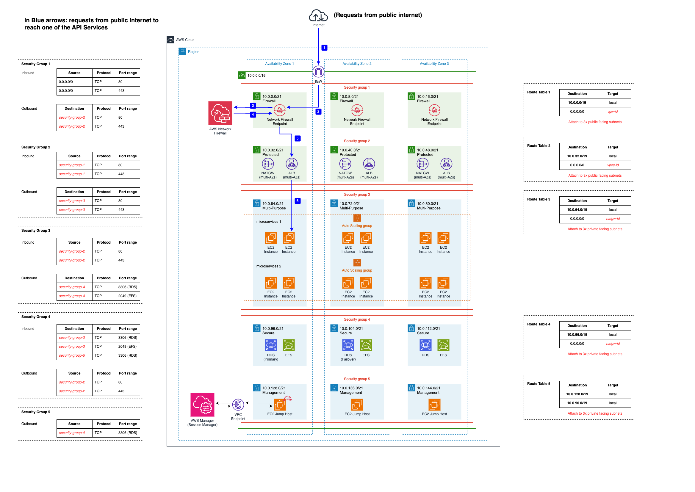

# Part I: Classic AWS Architecture Design

## Design Requirements

The objective of this architecture exercise was to design a scalable and highly available AWS infrastructure that satisfies the following requirements:

### Base Architecture Design

- Propose a CIDR allocation strategy for all network tiers and subnets.
- Design a VPC and subnet architecture across multiple Availability Zones.
- Correctly place the following AWS components within the architecture:
  - EC2 instances in Auto Scaling Groups.
  - Amazon RDS with a 1-AZ failover setup.
  - Amazon EFS.
  - Application Load Balancer (ALB).
  - NAT Gateway.
  - AWS Network Firewall endpoints.
  - Internet Gateway (IGW).
- Design appropriate Route Tables.
- Design inbound and outbound Security Group rules for different network tiers.

### Extended Network Design

- Design a solution to provide EC2 instances with access to Amazon S3 and DynamoDB.
- Illustrate service-to-service communication between two Auto Scaling Groups.
- Illustrate outbound traffic from an API service to an external public API.
- Illustrate inbound traffic flow from the public internet to an API service.

The following sections present the resulting architecture design and supporting network diagrams.

---

## Part I.1: Base Architecture Design

### The division table of CIDR:

---

## Part I.2: Extended Network Design

### 1. How would you add access for the EC2 instances to S3 and DynamoDB?

**Explain the method:**

- The most convenient method to add access for the EC2 instances to S3 and DynamoDB is by using the Gateway VPC Endpoints.
- Gateway VPC endpoints establish a secure connection to Amazon S3 and DynamoDB without the necessity for an internet gateway or a NAT device in your VPC. Gateway endpoints differ from other types of VPC endpoints as they don't utilise AWS PrivateLink, which is simple.
- Moreover, there is no additional charge for using Gateway Endpoints.
- To extend my explanation, actually, we can also use Interface VPC Endpoints to access S3 (but not DynamoDB). Interface Endpoints enable connectivity to services over AWS PrivateLink. However, Interface VPC Endpoints are implemented using Elastic Network Interfaces (ENIs). They offer more advanced features and depending on your network design and scale, this can lead to a larger number of ENIs, potentially impacting resource utilisation in your VPC. In addition, Interface VPC Endpoints' usage for S3 is billed.
- Therefore, the best option to add access for the EC2 instances to both S3 and DynamoDB is with Gateway VPC Endpoints.

---

### 2. Given that there are 2 AutoScalingGroups for 2 different applications, illustrate the flow of traffic in 3 different Network diagram figures (use the Base design figure as a starting point):

### A. In Green arrows: from 1 API Service Group to another (1 separate figure expected)

**Option 1: 2 API Service Groups on the same subnet:**
_Extended_Network_Design.png>)

**Option 2: 2 API Service Groups on different AZs:**
_Extended_Network_Design.png>)

### B. In Orange arrows: from 1 API Service to reach out to Google Maps API in the public internet to get more data (another separate figure expected)

### C. In Blue arrows: requests from public internet to reach one of the API Services (and another separate figure expected)

