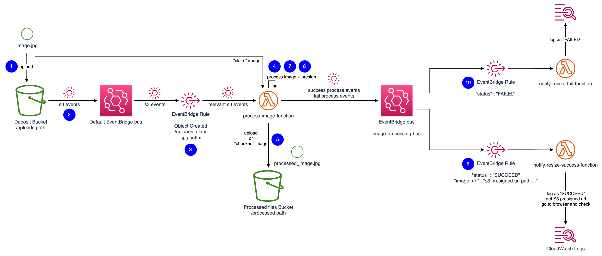
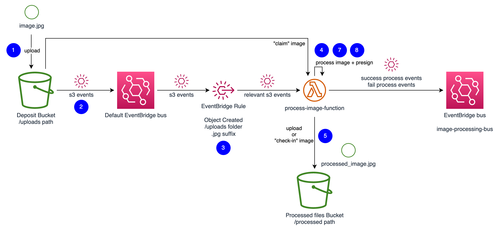
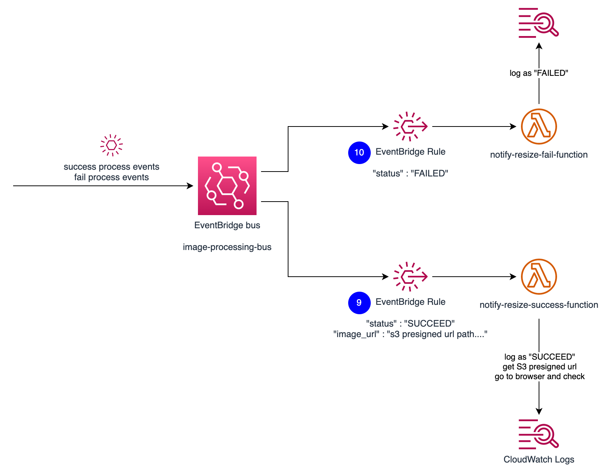

# Part III: Serverless Event-Driven Image Processing Pipeline

## Overview

This project demonstrates an event-driven serverless image processing pipeline built on AWS using Amazon S3, AWS Lambda, and Amazon EventBridge.

The solution automatically processes uploaded images, generates resized versions, publishes processing events, and triggers notifications based on the outcome of the workflow. The architecture follows an event-driven design pattern and uses AWS managed services to minimise infrastructure management overhead.

## Architecture Overview

The workflow consists of three main stages:

### Image Upload and Processing

- A user uploads a `.jpg` image to an Amazon S3 bucket under the `uploads/` folder.
- Amazon S3 publishes object creation events to Amazon EventBridge.
- An EventBridge rule filters only newly created `.jpg` files within the `uploads/` path.
- The `process-image-function` Lambda function resizes the image while preserving its aspect ratio.

### Processed Image Handling

- The resized image is saved to a separate S3 bucket under the `processed/` folder.
- The processing function publishes events to a custom EventBridge bus named `image-processing-bus`.
- Successful processing events include a publicly shareable S3 presigned URL for the resized image.
- Failed processing events include a failure status for downstream handling.

### Event-Driven Notifications

- Success events trigger the `notify-resize-success-function` Lambda function.
- Failure events trigger the `notify-resize-fail-function` Lambda function.
- Notification functions record processing outcomes through CloudWatch Logs.

## AWS Services Used

- Amazon S3
- AWS Lambda
- Amazon EventBridge
- Amazon EventBridge Custom Event Bus
- Amazon CloudWatch
- Serverless Framework

## Architecture Diagrams

### Overall Architecture



### Image Processing Flow



### Success and Failure Event Handling



## Project Structure

```text
app/
├── functions/
│   ├── process_image_function.py
│   ├── notify_resize_success_function.py
│   └── notify_resize_fail_function.py
├── test/
├── serverless.yml
└── requirements.txt
```

## Key Concepts Demonstrated

- Event-driven architecture.
- Serverless application design.
- Event filtering with EventBridge.
- Custom EventBridge event buses.
- AWS Lambda image processing.
- S3 presigned URLs.
- Decoupled service communication.
- Success and failure event handling.
- Infrastructure as Code using Serverless Framework.
